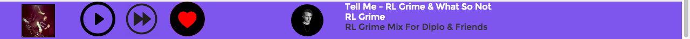
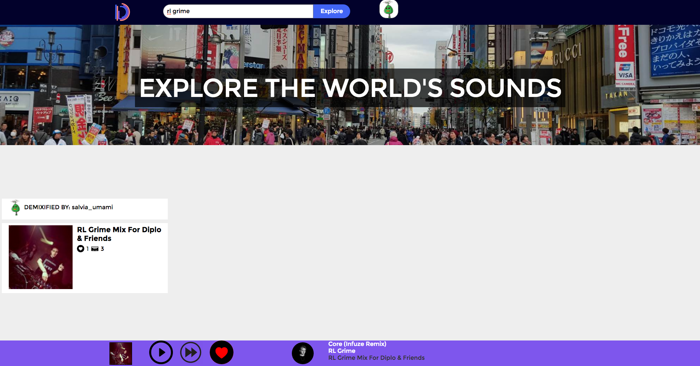
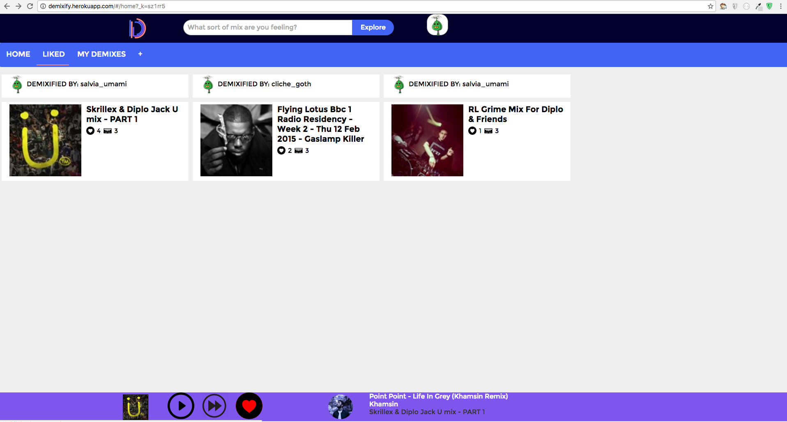
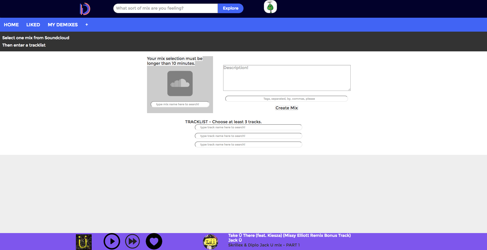

# DEMIXIFY

[Demxify live][site]
[site]: http://demixify.xyz

Demixify is a full stack application inspired by 8tracks. It uses Redux + React
on the frontend, Ruby on Rails in the backend, and a PostgreSQL database.

The idea is different, in that the goal of demixify to break up DJ mixes
into playist I call demixes.

## Features and Implementation
### Single Page App

Demixify is delivered as a single page application. It is broken up into several main features, (which are themselves React components). The entire app is built upon the sound player that opens up upon the first song played.

### The Sound Player

The sound player is a React component I created to provide a continuous listening
experience for users as they navigate the app. I used the soundcloud-audio NPM
package to resolve soundcloud permalink urls and fetch an audio stream from the
soundcloud API. They player pulls relevant data about the played track, as well as if it is
liked by the current user.

### Search Mixes

Like 8tracks itself, Demixify has a handy search bar always present in the top
nav bar. At any time, you can simply query a demix by artist and have them appear.
This was implemented in Redux by simply filtering through mixes already fetched
from our data store upon the first page render. You can search whether or not
you've logged in.

TODO: have search bar autofill and search by tags.

### Dashboard

Upon login, users are greeted with their personal dashboard. From here, users can view
all demixes in the Home bar, their Liked demixes, or create a new demix.

### Demix Creation

Users when logged in can create demix, which consist of 1 mix and 3 (ideally it would
	be any amount) tracks. Once the create mix button is hit, the mix is stored in the DB
	and should appear in the Home page.

TODO: make tracklist be variable in size
